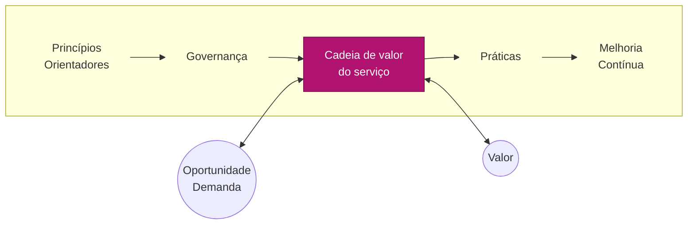
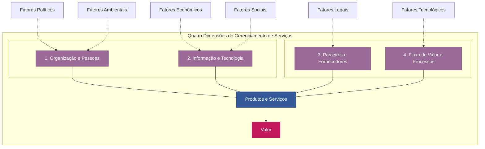

# ITIL 4 - Básico

## O que é?

ITIL 4 é um modelo para gerenciamento de Serviços de TI. Trata-se de um conjunto de boas práticas, reconhecido mundialmente para Gerenciamento de Serviços de TI (ITSM).

### Contexto histórico e evolução do ITIL

#### ITIL v1 - Origem (1980)

Foi criado pelo governo do reino unido, por meio da CCTA (Central Computer and Telecommunication Agency) com o objetivo de padronizar a entrega de serviços de TI no setor público. Seu foco inicial estava na infraestrutura, com uma série de livros descrevendo boas práticas para gestão de operações de TI.

#### ITIL v2 (2000)

Nessa versão, os processos foram organizados de forma mais estruturada, com o foco nos aspectos operacionais da TI. Dois livros - Suporte ao Serviço e Entrega do Serviço, padronizaram práticas como Ger, de Incidentes, Problemas, Mudanças e Níveis de Serviço, sendo adotados por empresas em busca de eficiência e estabilidade operacional.

#### ITIL v3 (2007)

Introduz o Ciclo de Vida do Serviço, composto por cinco fases: Estratégia, Desenho, Transição, Operação e Melhoria Contínua.

##### Atualizou em 2011

Essa mudança refletiu a necessidade de alinhamento entre TI e o negócio, incentivando a gestão completa do serviço, desde o planejamento até sua melhoria contínua.

#### ITIL 4 (2019)

Com a chegada das metodologias ágeis, DevOps e de transformação digital, o ITIL 4 passou a adotar uma abordagem flexível, baseada no Sistema de Valor de Serviço (SVS) e nos Princípios Orientadores. A nova versão destaca colaboração, adaptabilidade e foco no valor, tornando a TI mais estratégica e alinhada às necessidades do negócio.

## Conceitos Essenciais do ITIL

- Serviço: meio de entregar valor, facilitando resultados que os clientes desejam alcançar. Provedor do Serviço → Serviço → Consumidor de Serviço
- Valor: Benefício percebido pelo cliente; combinação de utilidade (o que faz) e garantia (como entrega).
- Provedor de Serviço: Organização ou equipe que projeta, gerencia e entrega serviços de TI.
- Consumidor de Serviço: indivíduo ou organização que consome os serviços oferecidos.
  - Usuário: quem utiliza diretamente o serviço no dia.
  - Cliente: quem define os requisitos do serviço e negocia o contrato/acordo com o provedor.
- Gerenciamento de Serviços (GSTI): conjunto de recursos organizacionais especializados para gerar valor aos clientes na forma de serviços.
- Saída: entrega tangível ou intangível que contribui com a realização do resultado de uma atividade.
- Resultado: efeito ou consequência para uma parte interessada possível através de uma ou mais saídas.
- Risco: evento que pode causar danos, perdas e dificultar o alcance de objetivos. Existem dois tipos que preocupam os consumidores do serviço:
  - Riscos removidos do consumidor pelo serviço;
  - Riscos impostos ao consumidor pelo serviço;
- Utilidade: funcionalidade oferecida por um produto ou serviço para atender a uma necessidade específica. Refere-se aos Requisitos Funcionais.
- Garantia: confirmação de que um produto ou serviço atenderá aos requisitos acordados. Refere-se aos Requisitos não funcionais.
-

## Porque ITIL é importante para o GSTI/ISTM?

A adoção do ITIL fortalece a Gestão de Serviços de TI (GSTI) ao promover:

- Organização e padronização dos processos de TI
- Alinhamento entre TI e as estratégias de negócio
- Melhoria contínua de qualidade dos serviços e da experiência do usuário
- Redução de riscos, falhas e retrabalho
- Tomada de decisão mais embasada e eficiente

## Conceitos de Gerenciamento de Serviços de TI

### O que é GSTI?

Gerenciamento de Serviços de Tecnologia da Informação (GSTI) é uma abordagem estratégica para planejar, entregar, operar e controlar os serviços de TI oferecidos às organizações e seus clientes.

### Objetivos do GSTI

- Garantir que os serviços de TI estejam alinhados às necessidades do negócio;
- Melhorar continuamente a qualidade dos serviços;
- Otimizar recursos e reduzir custos operacionais;
- Aumentar a satisfação dos usuários e clientes.

### Principais benefícios da GSTI

- Maior controle e visibilidade dos serviços;
- Redução de riscos operacionais;
- Aumento da eficiência dos processos de TI;
- Melhoria no relacionamento entre TI e as áreas de negócio.

### TI Tradicional x TI Orientada a Serviços

#### De suporte técnico à entrega de valor

| TI Tradicional | TI Orientada a Serviços (GSTI) |
| -------------- | ------------------------------ |
| Foco em infraestrutura e tecnologia | Foco na entrega de valor ao cliente e ao negócio |
| Abordagem reativa: atua quando algo dá errado | Abordagem proativa e baseada em processos |
| Visão técnica e isolada das áreas de negócio | Integração entre TI e objetivos estratégicos da organização |
| Métricas baseadas em disponibilidade e desempenho técnico | Métricas baseadas em níveis de serviço, satisfação e resultados |
| Baixa percepção de valor agregado pelo negócio | Percepção da TI como parceira estratégica |

### Princípios Orientadores

Os Princípios Orientadores da ITIL 4 são recomendações universais que orientam organizações e profissionais na tomada de decisões, no desenvolvimento de iniciativas e na melhoria contínua dos serviços de TI.

Eles representam valores fundamentais que devem ser considerados em qualquer situação, independente do porte da organização, da complexidade dos serviços ou do nível de maturidade da gestão de TI.

A aplicação desses princípios promove uma cultura organizacional mais ágil colaborativa, prática e centrada no valor entregue ao cliente. Eles ajudam a alinhar ações táticas e operacionais aos objetivos estratégicos do negócio, contribuindo para uma gestão mais eficiente, adaptável e sustentável.

Em vez de seguir uma ordem sequencial, os Princípios Orientadores atual como guias de conduta que devem ser utilizados conjuntamente e de forma contínua, em todo ciclo de vida dos serviços de TI.

## 1. Foco no Valor

Conceito: Esse princípio orienta que toda atividade, processo, serviço ou melhoria deve estar alinhada com a geração de valor para o cliente, usuário e para o negócio.

O valor não é definido pela TI, mas sim pela percepção do cliente sobre os benefícios recebidos, em relação aos custos e riscos envolvidos.

### Aplicações Práticas - Foco no Valor

Antes de iniciar um projeto ou processo, pergunte: "Isso agrega valor para quem?"

- Envolva os usuários na definição de requisitos e melhorias.
- Alinhe indicadores de desempenho com os objetivos de negócio.

#### Dicas importantes

- Foque nos resultados, não apenas nas entregas.
- Entenda o que é valor para cada parte interessada (cliente, usuário, negócio).
- Evite atividades que consomem recursos sem gerar benefícios claros.

## 2. Comece de onde você está

**Conceito**: Este princípio enfatiza a importancia de avaliar e aproveitar os recursos, processos e capacidades já existentes antes de iniciar qualquer mudança.

Muitas vezes, há ativos valiosos, práticas eficazes e conhecimento interno que podem (e devem) ser utilizados como base para evolução, evitando desperdício de tempo, esforço e dinheiro.

### Aplicações Práticas - Comece de onde você está

- Faça uma avaliação honesta do estado atual antes de propor mudanças.
- Reaproveite processos, ferramentas e competências que já funcionam.
- Identifique o que pode ser melhorado, não substituído.

### Dicas importantes - Comece de onde você está

- Não presuma que tudo está errado.
- Use dados, métricas e feedback para embasar decisões.
- Valorize a experiência da equipe e a história da organização.

## 3. Progredir iterativamente com feedback

**Conceito**: Esse princípio orienta que grandes iniciativas devem ser divididas em partes menores, permitindo entregas mais rápidas, aprendizado contínuo e ajustes com base em feedback real.

É uma abordagem inspirada em métodos ágeis e Lean, que ajuda a reduzir riscos e aumentar o valor entregue ao longo do tempo.

### Aplicações Práticas - Progredir iterativamente com feedback

- Divida projetos em fases curtas e controladas (sprints, etapas).
- Busque feedback constante de usuários e stakeholders a cada entrega.
- Aprenda com os erros e acertos rapidamente, antes de seguir para próxima etapa.

### Dicas importantes - Progredir iterativamente com feedback

- Planeje, execute, avalie e aprimore em ciclos curtos.
- Não espere a "solução perfeita" para entregar valor.
- Use o feedback como ferramenta de aprendizado e adaptação.

## 4. Pensar e trabalhar holisticamente

**Conceito**: Nenhum serviço, processo ou mudança funciona isoladamente. Tudo está interconectado - pessoas, tecnologia, processos, informações e parceiros.

Para que um serviço de TI entregue valor real, é preciso entender e gerenciar o sistema como um todo, considerando todas as suas interdependências.

### Aplicações Práticas - Pensar e trabalhar holisticamente

- Analise o impacto de mudanças além de sua área: quem mais será afetado?
- Considere todas as partes envolvidas no ciclo de vida do serviço (clientes, segurança, suporte etc.)

### Dicas importantes - Pensar e trabalhar holisticamente

- Evite decisões locais que causem problemas em outras áreas.
- Busque sempre entendimento amplo antes de agir pontualmente.

## 5. Mantenha tudo simples e prático

**Conceito**: Esse princípio defende que quanto mais simples um processo, serviço ou solução, mais eficaz ele será. A complexidade desnecessária aumenta o risco de falhas, causa confusão e atrasa a entrega de valor.

Manter a simplicidade exige disciplina, foco no essencial e eliminação do que não agrega valor.

### Aplicações Práticas - Mantenha tudo simples e prático

- Avalie constantemente: isso é mesmo necessário?
- Elimine etapas, relatórios e controles que não geram valor direto.
- Prefira soluções claras, objetivas e de fácil entendimento por todos os envolvidos.

### Dicas importantes - Mantenha tudo simples e prático

- Simples não é sinônimo de superficial.
- Ouça quem executa os processos na prática.
- Documentação e burocracia devem ser funcionais.

## 6. Otimizar e automatizar

**Conceito**: Este princípio orienta que, antes de automatizar qualquer processo, é necessário otimizá-lo - ou seja, torná-lo o mais eficiente possível.

Somente depois de eliminar desperdícios, simplificar e padronizar, é que a automação agrega valor real, reduzindo erros, aumentando a velocidade e libertando recursos para tarefas mais estratégicas.

### Aplicações Práticas - Otimizar e automatizar

- Analise e melhore o processo manual antes de automatizá-lo.
- Use tecnologia para eliminar tarefas repetitivas e operacionais.
- Avalie o custo-benefício da automação: vale a pena?
  
### Dicas importantes - Otimizar e automatizar

- Nem tudo precisa ser automatizado. Automatize com propósito.
- Envolva usuários e equipes técnicas na definição do que será automatizado.
- Use indicadores para validar os ganhos (tempo, qualidade, custo).

## 6. Estrutura do SVS - Sistema de Valor de Serviço

É um modelo do ITIL 4 que descreve como todos os componentes e atividades de uma organização trabalham juntos para facilitar a criação de valor por meio da gestão de serviços.\
Ele garante que a organização mantenha uma abordagem holística e integrada, alinhando princípios, governança, práticas e melhoria contínua para entregar de valor ao cliente e ao negócio.\
É um modelo flexível e adaptável, permitindo diferentes fluxos de valor de acordo com cada necessidade ou contexto do negócio.

### Objetivo do SVS

Assegurar que a organização esteja sempre orientada à geração de valor, de forma consistente, controlada e adaptável a mudanças.
> **Objetivo da CVS:** permitir que a organização responda de forma ágil e eficaz às demandas, entregue valor continuamente e mantenha serviços relevantes e de alta qualidade.

### Componetes Principais do SVS

- **Princípios Orientadores** - orientam decisões e comportamento em qualquer situação.
- **Governança** - garante alinhamento estratégico, controle e responsabilidade.
- **Cadeia de Valor do Serviço** - modelo operacional que mostra como a TI transforma demanda em valor.
- **Melhoria Contínua** - ciclo constante para evoluir serviços, processos e resultados.

```mermaid
flowchart LR

    O((Oportunidade<br/>Demanda))

    subgraph SVS["Sistema de Valor de Serviço"]
        direction TB

        PO[Princípios Orientadores]
        GOV[Governança]

        CVS[Cadeia de Valor<br/>do Serviço]

        PRA[Práticas]
        MC[Melhoria Contínua]

        PO --> GOV
        GOV --> CVS
        CVS --> PRA
        PRA --> MC
    end

    V((Valor))

    O --> CVS
    CVS --> V

    CVS -. Zoom .-> PLAN

    subgraph DETALHE["Detalhamento da Cadeia de Valor do Serviço"]
        direction TB

        PLAN[Planejar]

        subgraph FLUXO[" "]
        direction LR
            DEM((Demanda))
            ENG[Engajar]
            OC[Obter / Construir]
            ES[Entrega e Suporte]
            PS[Produtos e Serviços]
            VAL((Valor))

            DEM --> ENG
            ENG --> OC
            OC --> ES
            ES --> PS
            PS --> VAL
        end

        DT[Desenho e Transição]
        MEL[Melhorar]

        PLAN --> ENG
        PLAN --> DT
        DT --> OC
        DT --> ES

        MEL -.-> ENG
        MEL -.-> PLAN
        MEL -.-> DT
        MEL -.-> OC
        MEL -.-> ES
        MEL -.-> PS
        MEL -.-> VAL
    end

    style CVS fill:#b0126f,color:#fff
    style ENG fill:#c2185b,color:#fff
    style OC fill:#d81b60,color:#fff
    style ES fill:#ad1457,color:#fff
    style PS fill:#1565c0,color:#fff
```

> "O SVS é o mapa que coneta tudo o que a TI faz ao que realmente importa: entregar valor."

#### Atividades da Cadeia de Valor do Serviço

1. **Planejar**: Garantir visãõ compartilhada sobre objetivos e direcionamento.
2. **Engajar**: Entender as necessidades, contruir relacionamentos e alinhar expectativas.
3. **Desenho e Transição**: Garantir que serviços novos ou modificados sejam criados e entregue.
4. **Obter & Construir**: Adquirir ou desenvolver os componentes necessários para os serviços.

### 4 Dimensões do GSTI

As 4 dimensões do GSTI são perspectivas que devem ser consideradas em todas as iniciativas de gestão de serviços, garantindo que os serviços sejam eficazes, sustentáveis e alinhados ao valor esperado pelo negócio.\
Essas dimensões formam a base de sustentação do Sistema de Valor de Serviço (SVS) da ITIL 4.

1. **Organização e Pessoas**: Refere-se à **estrutura organizacional**, **cultura**, **competências** e **capacidades humanas** envolvidas na criação, entrega e suporte aos serviços.
    - Envolve: equipes, líderes, cultura, comunicação, conhecimento.
    - Relevância: garante eficiência, agilidade e inovação nos serviços.

2. **Informação e Tecnologia**: 