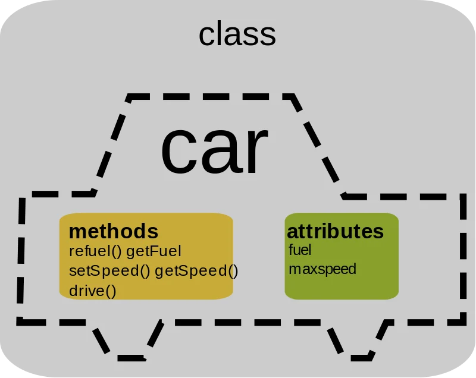

# POO - Programação Orientada a Objetos
A programação orientada a objetos (POO) é uma forma de programar que organiza o código em torno de objetos, que combinam dados (atributos) e ações (métodos).

Existe várias formas de se programar, esses modos são paradigmas de programação. A POO é um dos paradigmas mais populares e amplamente utilizados, especialmente em linguagens como Java, C++, Python e C#.

## O que são objetos?
São unidades que combinam dados/atributos e ações/métodos. Por exemplo, um objeto "Carro" pode ter atributos como "cor", "modelo" e "ano", e métodos como "acelerar()" e "frear()".

### Atributos ou propriedades
Se referem a informações ou características de um objeto. No exemplo do "Carro", os atributos seriam "cor", "modelo" e "ano". Eles armazenam os dados que descrevem o estado do objeto.

### Métodos, funções ou ações
São as operações ou comportamentos que um objeto pode realizar. No exemplo do "Carro", os métodos seriam "acelerar()" e "frear()". Eles definem o que o objeto pode fazer ou como ele pode interagir com outros objetos.

### O que são classes?
É um conjunto de características e comportamentos que definem um tipo de objeto. A classe é como um molde ou uma receita para criar objetos. No exemplo do "Carro", a classe "Carro" define os atributos e métodos que todos os objetos "Carro" terão.

## As principais características da programação orientada a objetos
São duas bases e 2 derivados fundamentais da POO os pilares da orientação a objetos.

### Encapsulamento
O encapsulamento é o princípio de ocultar os detalhes internos de um objeto e expor apenas o que é necessário para interagir com ele. Isso ajuda a proteger os dados e a garantir que o objeto seja usado de maneira correta.

  

### Herança
No exemplo do "Carro", podemos ter uma classe "Veículo" que tem atributos e métodos comuns a todos os veículos, como "velocidade" e "mover()". A classe "Carro" pode herdar esses atributos e métodos da classe "Veículo", além de adicionar seus próprios atributos e métodos específicos. Isso promove a reutilização de código e a criação de hierarquias de classes.

### Interface
Muitos métodos são comuns em vários automóveis (classes), como "acelerar()", "frear()", "virar()". Para evitar a repetição de código, podemos criar uma interface "Veículo" que declare esses métodos, e as classes "Carro", "Moto" e "Caminhão" podem implementar essa interface, garantindo que todas elas tenham esses métodos, mas permitindo que cada classe tenha sua própria implementação.

### Polimorfismo
Vamos dizer que um dos motivos de você ter comprado um carro foi a qualidade do sistema de som dele.

Mas, no seu caso, digamos que a reprodução só pode ser feita via rádio ou bluetooth, enquanto que no seu antigo carro, podia ser feita apenas via cartão SD e pendrive.

Em ambos os carros está presente o método "tocar música" mas, como o sistema de som deles é diferente, a forma como o carro toca as músicas é diferente.

Dizemos que o método "tocar música" é uma forma de polimorfismo, pois dois objetos, de duas classes diferentes, têm um mesmo método que é implementado de formas diferentes, ou seja, um método possui várias formas, várias implementações diferentes em classes diferentes, mas que possuem o mesmo efeito ("polimorfismo" vem do grego poli = muitas, morphos = forma).

## Clean code e SOLID
Principios de boas práticas de design de software são diretrizes que ajudam os desenvolvedores a criar código mais limpo, legível e fácil de manter. Alguns dos princípios mais conhecidos incluem:
- KISS (Keep It Simple, Stupid, "Mantenha as coisas simples"): Sempre que um código for escrito, ele deve ser escrito da forma mais simples possível, para manter o código mais legível. Códigos complexos demais são mais difíceis de se manter, j que é mais difícil entender o que ele faz e como ele faz.
- DRY (Don't Repeat Yourself, "Não se repita"): Todo código escrito para resolver um problema deve ser escrito apenas uma vez, a fim de evitar repetição de código. É quase uma variação do KISS, dado que a repetição de código o torna mais confuso e difícil de manter e corrigir, se necessário.

### Design Patterns
Um Design Pattern não é um pedaço de código que você pode copiar e colar. Não é uma biblioteca ou um framework. 

Um Padrão de Projeto é uma descrição ou um modelo de como resolver um problema específico, que pode ser usado em muitas situações diferentes.

Pense nele como uma receita de culinária. A receita descreve os ingredientes, os passos e o resultado esperado, mas não é a comida em si. 

Você pega a receita, adapta os ingredientes que tem à disposição e segue os passos para criar seu próprio prato. 

Da mesma forma, um Design Pattern oferece a estratégia e a estrutura da solução, e você, como pessoa desenvolvedora, implementa essa estratégia usando a linguagem de programação de sua preferência.

O objetivo principal é fornecer um vocabulário comum para a equipe de desenvolvimento e acelerar o processo, evitando que se perca tempo com problemas já solucionados.

- Vocabulário comum: Facilita a comunicação na equipe. Em vez de explicar uma solução complexa por dez minutos, você pode simplesmente dizer: "Vamos usar um padrão Strategy aqui". Todos que conhecem o padrão entenderão imediatamente a intenção.
- Economia de tempo e esforço: Você não precisa "reinventar a roda". Os padrões são soluções otimizadas e testadas por milhares de pessoas ao redor do mundo. Eles ajudam a evitar armadilhas comuns que podem levar a um código difícil de manter.
- Qualidade e manutenibilidade do código: Utilizar padrões resulta em um código mais organizado, flexível, reutilizável e fácil de entender por outras pessoas (ou por você no futuro).
- Base para arquiteturas complexas: Eles são os "tijolos" fundamentais sobre os quais arquiteturas de software mais complexas são construídas.